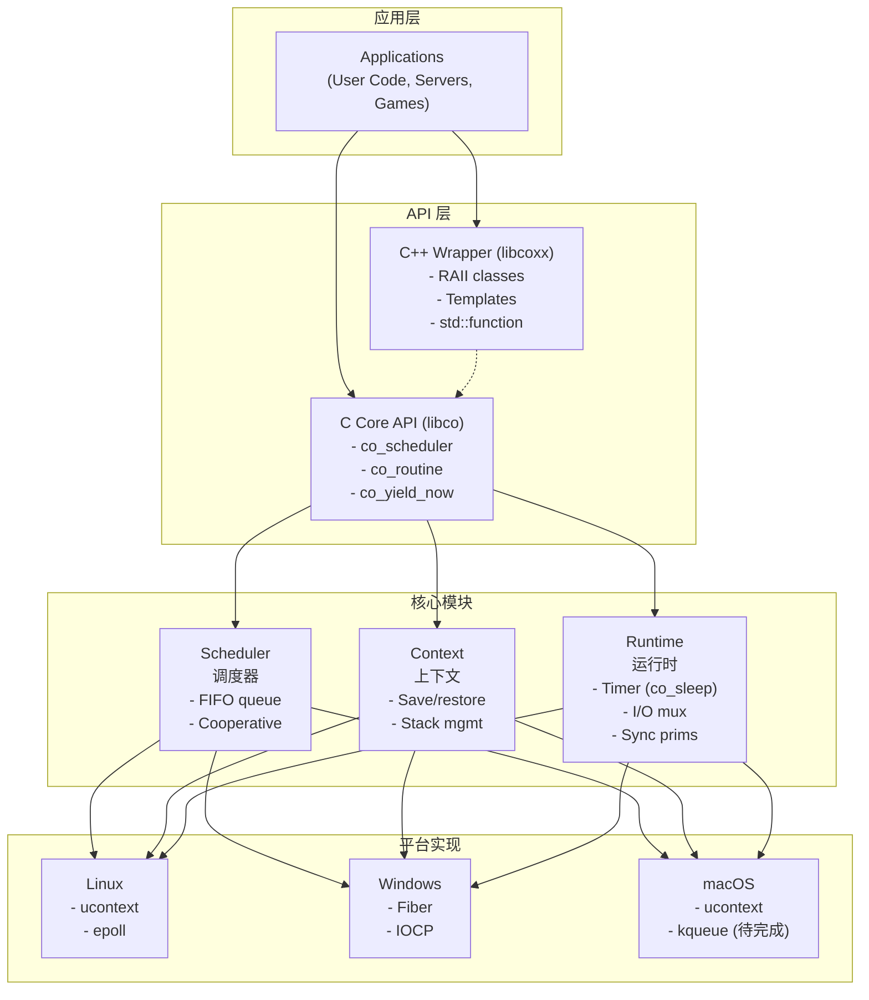

# 架构设计

> **📌 版本说明**：本文档描述 libco v2.0 的**当前实现架构**。
> 
> 本文档反映已完成的功能，不包括计划中的扩展特性（如优先级调度、TLS、Select 等）。

## 整体架构



## 核心模块

### 1. Context（上下文管理）

**职责**：管理协程的执行上下文（寄存器、栈指针等）

```c
// 核心接口
typedef struct co_context co_context_t;

// 初始化上下文
int co_context_init(co_context_t* ctx, 
                    void* stack_base, 
                    size_t stack_size,
                    co_entry_func_t entry,
                    void* arg);

// 切换上下文
int co_context_swap(co_context_t* from, co_context_t* to);

// 销毁上下文
void co_context_destroy(co_context_t* ctx);
```

**实现策略**：
- **Linux/macOS**：优先使用 `ucontext`，fallback 到汇编
- **Windows**：使用 `Fiber API`
- **性能优化**：提供手写汇编版本（x86_64, ARM64）

### 2. Scheduler（调度器）

**职责**：管理协程的调度和执行

```c
typedef struct co_scheduler co_scheduler_t;
```

**当前实现的数据结构**：
```c
struct co_scheduler {
    // 就绪队列 (FIFO)
    co_queue_t ready_queue;
    
    // 定时器堆（用于 co_sleep）
    co_timer_heap_t timer_heap;
    
    // I/O 多路复用器
    co_iomux_t *iomux;              // epoll/IOCP
    
    // 当前运行的协程
    co_routine_t *current;
    
    // 主调度器上下文
    co_context_t main_ctx;
    
    // 栈池
    co_stack_pool_t *stack_pool;
    
    // 配置
    size_t default_stack_size;      // 默认栈大小
    
    // 运行状态
    bool running;                   // 调度器是否正在运行
    bool should_stop;               // 是否应停止
    
    // 统计信息
    uint64_t total_routines;        // 创建的协程总数
    uint64_t active_routines;       // 当前活跃的协程数
    uint64_t switch_count;          // 上下文切换次数
    uint32_t waiting_io_count;      // 等待 I/O 的协程数
    
    // ID 生成器
    uint64_t next_id;               // 下一个协程 ID
};
```

**调度算法（当前实现）**：
1. **从就绪队列取出协程** - FIFO 顺序
2. **检查定时器堆** - 唤醒到期的 sleeping 协程
3. **检查 I/O 事件** - 通过 epoll/IOCP 唤醒就绪的协程
4. **如果无协程就绪** - 等待 I/O 事件或定时器超时
5. **切换到选中的协程** - 保存当前上下文，恢复协程上下文

### 3. Routine（协程）

**职责**：代表一个协程实例

```c
typedef struct co_routine co_routine_t;

typedef enum co_state {
    CO_STATE_READY = 0,     // 就绪
    CO_STATE_RUNNING,       // 运行中
    CO_STATE_SLEEPING,      // 睡眠中（co_sleep）
    CO_STATE_WAITING,       // 等待（I/O、同步原语等）
    CO_STATE_DEAD,          // 已结束
} co_state_t;
```

**当前实现的数据结构**：
```c
struct co_routine {
    // 唯一 ID
    uint64_t id;
    
    // 状态
    co_state_t state;
    
    // 执行上下文
    co_context_t context;
    
    // 栈信息
    void *stack_base;
    size_t stack_size;
    
    // 入口函数和参数
    co_entry_func_t entry;
    void *arg;
    
    // 所属调度器
    co_scheduler_t *scheduler;
    
    // 队列节点（用于 ready_queue）
    co_queue_node_t queue_node;
    
    // 定时器支持（co_sleep）
    uint64_t wakeup_time;           // 唤醒时间（毫秒）
    
    // Channel 支持
    void *chan_data;                // 发送/接收时的数据指针
    
    // 条件变量超时支持
    co_queue_t *cond_wait_queue;    // 条件等待队列（用于超时）
    bool timed_out;                 // 是否因超时被唤醒
    
    // I/O 等待支持
    bool io_waiting;                // 是否正在等待 I/O
    
    // 调试信息
    const char *name;               // 可选的协程名称
    
    // 生命周期管理
    bool detached;                  // 是否已分离
};
```

### 4. Runtime（运行时）

#### 4.1 Timer（定时器）

**当前实现**：
```c
// 休眠指定毫秒
co_error_t co_sleep(uint32_t msec);
```

**实现细节**：
- 使用最小堆（min-heap）管理睡眠中的协程
- 协程调用 co_sleep 后状态变为 CO_STATE_SLEEPING
- 调度器在每次循环中检查到期的协程并唤醒

#### 4.2 I/O Multiplexing

**当前实现的 I/O API**：
```c
// 协程化的套接字 I/O 操作
ssize_t co_read(co_socket_t fd, void *buf, size_t count, int64_t timeout_ms);
ssize_t co_write(co_socket_t fd, const void *buf, size_t count, int64_t timeout_ms);
co_socket_t co_accept(co_socket_t sockfd, void *addr, socklen_t *addrlen, int64_t timeout_ms);
int co_connect(co_socket_t sockfd, const void *addr, socklen_t addrlen, int64_t timeout_ms);
```

**平台实现**：
- ✅ Linux: `epoll`
- ⚠️ macOS: 上下文切换已实现，`kqueue` I/O 待完成
- ✅ Windows: `IOCP`

#### 4.3 Synchronization（同步原语）

**当前实现**：

```c
// 互斥锁
typedef struct co_mutex co_mutex_t;
co_mutex_t *co_mutex_create(const void *attr);
co_error_t co_mutex_destroy(co_mutex_t *mutex);
co_error_t co_mutex_lock(co_mutex_t *mutex);
co_error_t co_mutex_trylock(co_mutex_t *mutex);
co_error_t co_mutex_unlock(co_mutex_t *mutex);

// 条件变量
typedef struct co_cond co_cond_t;
co_cond_t *co_cond_create(const void *attr);
co_error_t co_cond_destroy(co_cond_t *cond);
co_error_t co_cond_wait(co_cond_t *cond, co_mutex_t *mutex);
co_error_t co_cond_timedwait(co_cond_t *cond, co_mutex_t *mutex, uint32_t timeout_ms);
co_error_t co_cond_signal(co_cond_t *cond);
co_error_t co_cond_broadcast(co_cond_t *cond);

// Channel（Go 风格）
typedef struct co_channel co_channel_t;
co_channel_t *co_channel_create(size_t elem_size, size_t capacity);
co_error_t co_channel_send(co_channel_t *ch, const void *data);
co_error_t co_channel_recv(co_channel_t *ch, void *data);
co_error_t co_channel_trysend(co_channel_t *ch, const void *data);
co_error_t co_channel_tryrecv(co_channel_t *ch, void *data);
co_error_t co_channel_close(co_channel_t *ch);
size_t co_channel_len(co_channel_t *ch);
size_t co_channel_cap(co_channel_t *ch);
co_error_t co_channel_destroy(co_channel_t *ch);
```

### 5. Memory（内存管理）

#### 5.1 Stack Pool

```c
typedef struct co_stack_pool co_stack_pool_t;

// 创建栈池
co_stack_pool_t* co_stack_pool_create(size_t stack_size, size_t initial_capacity);

// 分配栈
void* co_stack_pool_alloc(co_stack_pool_t* pool);

// 释放栈
void co_stack_pool_free(co_stack_pool_t* pool, void* stack);

// 销毁栈池
void co_stack_pool_destroy(co_stack_pool_t* pool);
```

#### 5.2 Custom Allocator

```c
typedef struct co_allocator {
    void* (*malloc_fn)(size_t size, void* userdata);
    void* (*realloc_fn)(void* ptr, size_t size, void* userdata);
    void (*free_fn)(void* ptr, void* userdata);
    void* userdata;
} co_allocator_t;

// 设置全局分配器
void co_set_allocator(const co_allocator_t* allocator);
```

## 平台抽象层

### 目录结构

```
libco/src/
├── core/                   # 核心组件目录（待开发）
│
├── platform/               # 平台抽象层
│   ├── context.h           # 平台上下文抽象接口
│   ├── linux/
│   │   ├── context.c       # Linux 上下文实现 (ucontext)
│   │   └── iomux_epoll.c   # epoll I/O 多路复用
│   ├── macos/
│   │   ├── context.c       # macOS 上下文实现 (ucontext)
│   │   └── iomux_kqueue.c  # kqueue I/O 多路复用（待实现）
│   └── windows/
│       ├── context.c       # Windows 上下文实现 (Fiber)
│       └── iomux_iocp.c    # IOCP I/O 多路复用
│
├── sync/                   # 同步原语
│   ├── co_channel.c/h      # Channel 通道
│   ├── co_cond.c/h         # 条件变量
│   └── co_mutex.c/h        # 互斥锁
│
├── co_allocator.c/h        # 自定义内存分配器
├── co_routine.c/h          # 协程对象和生命周期管理
├── co_scheduler.c/h        # 调度器核心逻辑
├── co_stack_pool.c/h       # 栈内存池管理
├── co_timer.c/h            # 定时器堆（最小堆）
├── co_iomux.h              # I/O 多路复用抽象接口
└── co_queue.h              # 内部队列数据结构
```

**说明**：
- **core/** 目录预留给未来的核心组件重构
- **platform/** 包含所有平台相关代码，便于跨平台维护
- **sync/** 集中管理同步原语，模块职责清晰
- 其他文件为核心功能的平台无关实现

### 平台检测与选择

**当前支持的平台**：
- ✅ **Linux** - ucontext + epoll
- ✅ **Windows** - Fiber + IOCP  
- ⏳ **macOS** - ucontext 实现（kqueue I/O 待完成）

```c
// 编译时平台选择（CMake 配置）
#if defined(__linux__)
    // Linux: ucontext + epoll
#elif defined(_WIN32)
    // Windows: Fiber + IOCP
#elif defined(__APPLE__)
    // macOS: ucontext + kqueue（待完成）
#endif
```

## 线程安全

### 当前设计

**单线程模型**：每个 scheduler 绑定到一个线程，无锁设计。

```c
// 获取当前线程的调度器
co_scheduler_t* co_current_scheduler(void);

// 获取当前协程
co_routine_t* co_current(void);
```

**多核利用**（推荐方案）：
```c
// 每个线程创建独立的调度器
co_scheduler_t *schedulers[NUM_THREADS];
for (int i = 0; i < NUM_THREADS; i++) {
    schedulers[i] = co_scheduler_create(NULL);
    // 在独立线程中运行
    pthread_create(&threads[i], NULL, run_scheduler, schedulers[i]);
}

// 手动负载均衡
int idx = connection_count++ % NUM_THREADS;
co_spawn(schedulers[idx], handle_connection, conn);
```

**说明**：
- ✅ 简单高效，无锁竞争
- ✅ 适合 I/O 密集型场景（libco 的主要定位）
- ✅ 易于调试和性能分析

## 错误处理

### 错误码定义

```c
typedef enum co_error {
    CO_OK            =   0,
    CO_ERROR         =  -1,   // 通用错误
    CO_ERROR_NOMEM   =  -2,   // 内存不足
    CO_ERROR_INVAL   =  -3,   // 无效参数
    CO_ERROR_PLATFORM=  -4,   // 平台特定错误
    CO_ERROR_TIMEOUT =  -5,   // 超时
    CO_ERROR_CANCELLED= -6,   // 已取消
    CO_ERROR_BUSY    =  -7,   // 资源暂时不可用（锁已被占用）
} co_error_t;

// 获取错误描述
const char* co_strerror(co_error_t err);

// 获取最后一个错误（线程本地）
co_error_t co_last_error(void);
```

## 性能考虑

### 1. Fast Path 优化

```c
// 内联关键函数
static inline co_routine_t* co_self(void) {
    extern __thread co_scheduler_t* __tls_current_scheduler;
    return __tls_current_scheduler ? __tls_current_scheduler->current : NULL;
}
```

### 2. 零拷贝

- 参数通过寄存器或栈传递
- Channel 使用环形缓冲区
- 避免不必要的内存拷贝

### 3. 内存局部性

- 将热数据放在同一缓存行
- 使用对象池减少碎片

### 4. 分支预测

```c
#ifdef __GNUC__
    #define likely(x)   __builtin_expect(!!(x), 1)
    #define unlikely(x) __builtin_expect(!!(x), 0)
#else
    #define likely(x)   (x)
    #define unlikely(x) (x)
#endif
```

## 可观测性

### 基础统计信息

调度器内置的统计字段：
```c
struct co_scheduler {
    // ...
    uint64_t total_routines;    // 创建的协程总数
    uint64_t active_routines;   // 当前活跃的协程数
    uint64_t switch_count;      // 上下文切换次数
    uint32_t waiting_io_count;  // 等待 I/O 的协程数
};
```

### Debug 模式

```c
// 编译时开关
#ifdef CO_DEBUG
    #define CO_LOG(level, fmt, ...) \
        co_log_internal(level, __FILE__, __LINE__, fmt, ##__VA_ARGS__)
#else
    #define CO_LOG(level, fmt, ...) ((void)0)
#endif
```

## 下一步

参见：
- [02-api-design.md](./02-api-design.md) - 详细 API 设计
- [03-implementation.md](./03-implementation.md) - 实现细节
- [04-testing.md](./04-testing.md) - 测试策略
