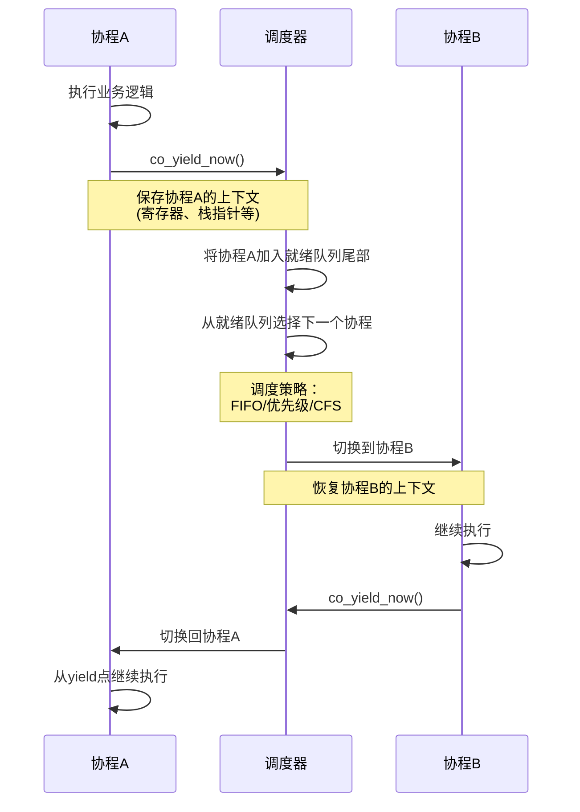
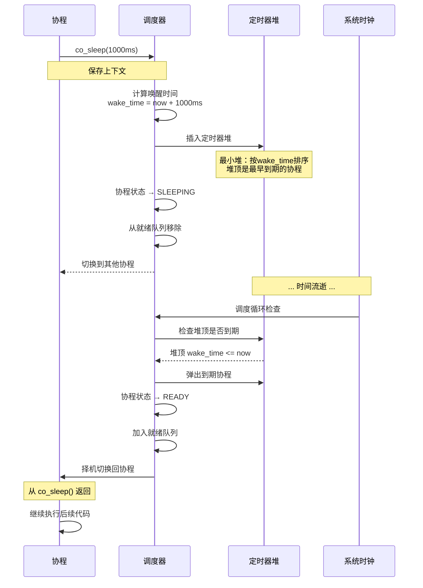
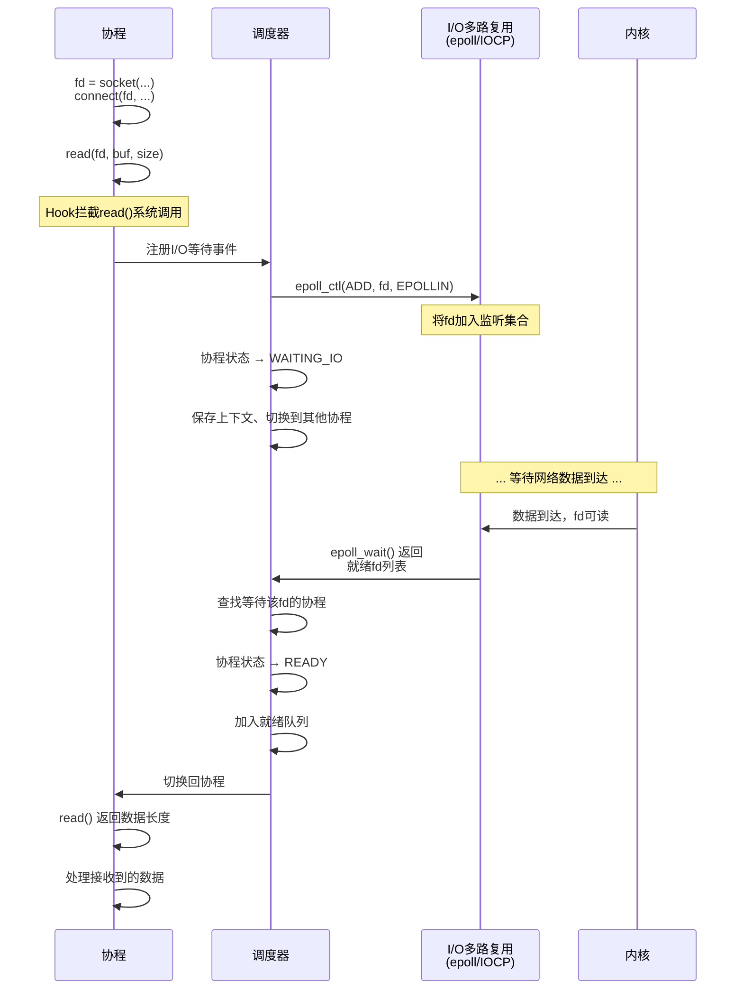

# 实现细节

> **版本说明**：本文档描述 libco v2.0 的实际实现细节。部分高级优化和设计理念作为未来参考保留。

## 上下文切换实现

### 1. Linux/macOS - ucontext 实现

```c
// src/platform/linux/context.c
// src/platform/macos/context.c

#include <ucontext.h>

struct co_context {
    ucontext_t uctx;
    void* stack_base;
    size_t stack_size;
};

co_error_t co_context_init(co_context_t* ctx, 
                           void* stack_base,
                           size_t stack_size,
                           co_entry_func_t entry,
                           void* arg) {
    // 保存栈信息
    ctx->stack_base = stack_base;
    ctx->stack_size = stack_size;
    
    // 存储 entry 和 arg 到栈顶供 wrapper 访问
    co_entry_func_t *entry_ptr = (co_entry_func_t *)stack_base;
    void **arg_ptr = (void **)((char *)stack_base + sizeof(co_entry_func_t));
    *entry_ptr = entry;
    *arg_ptr = arg;
    
    // 捕获当前上下文
    if (getcontext(&ctx->uctx) == -1) {
        return CO_ERROR_PLATFORM;
    }
    
    // 配置栈
    ctx->uctx.uc_stack.ss_sp = stack_base;
    ctx->uctx.uc_stack.ss_size = stack_size;
    ctx->uctx.uc_link = NULL;  // 协程结束时不链接到任何上下文
    
    // 构建新上下文（使用 wrapper 适配调用约定）
    uint32_t arg_low = (uint32_t)(uintptr_t)ctx;
    uint32_t arg_high = (uint32_t)((uintptr_t)ctx >> 32);
    makecontext(&ctx->uctx, (void (*)())ucontext_entry_wrapper, 2, arg_low, arg_high);
    
    return CO_OK;
}

co_error_t co_context_swap(co_context_t* from, co_context_t* to) {
    if (swapcontext(&from->uctx, &to->uctx) == -1) {
        return CO_ERROR_PLATFORM;
    }
    return CO_OK;
}
```

### 2. Windows - Fiber 实现

```c
// src/platform/windows/context.c

#include <windows.h>

struct co_context {
    LPVOID fiber;
    void* stack_base;
    size_t stack_size;
    co_entry_func_t entry;
    void* arg;
};

static VOID CALLBACK fiber_entry(LPVOID param) {
    co_context_t* ctx = (co_context_t*)param;
    ctx->entry(ctx->arg);
}

int co_context_init(co_context_t* ctx,
                    void* stack_base,
                    size_t stack_size,
                    co_entry_func_t entry,
                    void* arg) {
    ctx->fiber = CreateFiber(stack_size, fiber_entry, ctx);
    if (!ctx->fiber) {
        return CO_ERROR_PLATFORM;
    }
    
    ctx->stack_base = stack_base;
    ctx->stack_size = stack_size;
    ctx->entry = entry;
    ctx->arg = arg;
    
    return CO_OK;
}

int co_context_swap(co_context_t* from, co_context_t* to) {
    // 首次调用时需要将当前线程转换为 Fiber
    if (!from->fiber) {
        from->fiber = ConvertThreadToFiber(NULL);
        if (!from->fiber) {
            return CO_ERROR_PLATFORM;
        }
    }
    
    SwitchToFiber(to->fiber);
    return CO_OK;
}
```

### 3. 手写汇编实现（可选，性能优化）

```asm
; src/platform/asm/context_x86_64.S
; x86_64 System V ABI

.text
.globl co_context_swap_asm

co_context_swap_asm:
    ; Save current context
    ; rdi = from, rsi = to
    
    ; Save callee-saved registers
    pushq %rbp
    pushq %rbx
    pushq %r12
    pushq %r13
    pushq %r14
    pushq %r15
    
    ; Save stack pointer
    movq %rsp, (%rdi)
    
    ; Restore target context
    movq (%rsi), %rsp
    
    ; Restore callee-saved registers
    popq %r15
    popq %r14
    popq %r13
    popq %r12
    popq %rbx
    popq %rbp
    
    ; Return to target
    ret
```

## 协程切换场景与流程

本节通过流程图展示三种典型的协程切换场景，帮助理解协程如何在实际应用中进行上下文切换。

### 场景1：co_yield_now() - 主动让出CPU

协程主动调用 `co_yield_now()` 让出CPU，是最基础的协程切换场景。



**关键步骤**：
1. 协程A调用 `co_yield_now()`
2. 保存协程A的寄存器状态到 `co_context_t`
3. 将协程A状态设为 `READY`，放入就绪队列
4. 调度器根据策略选择下一个协程B
5. 恢复协程B的上下文，切换执行流
6. 协程A等待下次被调度

---

### 场景2：co_sleep() - 定时休眠与唤醒

协程调用 `co_sleep()` 进入定时休眠，到期后自动唤醒。



**关键数据结构**：
- **定时器堆**：最小堆，O(log n) 插入/删除
- **wake_time**：绝对时间戳，避免累积误差
- **调度循环**：每次迭代检查堆顶是否到期

**精度保证**：
- 使用高精度时钟（`std::chrono` / `clock_gettime`）
- 休眠精度 < 10ms（取决于系统定时器分辨率）

---

### 场景3：I/O阻塞 - 异步等待与唤醒

协程执行阻塞I/O操作（如 `read()`、`accept()`），通过I/O多路复用实现异步等待。



**I/O 等待机制（v2.0 实现）**：

> **注意**：v2.0 **未实现完整的 Hook 系统**。实际使用显式的协程 I/O API。

```c
// v2.0 实际实现：显式协程 I/O API (libco/include/libco/co.h)
ssize_t co_read_timeout(co_socket_t fd, void* buf, size_t len, int timeout_ms);
ssize_t co_write_timeout(co_socket_t fd, const void* buf, size_t len, int timeout_ms);
co_socket_t co_accept_timeout(co_socket_t listen_fd, struct sockaddr* addr, 
                              socklen_t* addrlen, int timeout_ms);

// 典型的协程 I/O 等待流程（以 co_wait_io 为例）
co_error_t co_wait_io(co_socket_t fd, co_io_event_t events, int timeout_ms) {
    co_scheduler_t* sched = co_current_scheduler();
    co_routine_t* co = co_current_routine();
    
    // 注册 I/O 事件到多路复用器
    co_io_wait_ctx_t wait_ctx = {
        .routine = co,
        .fd = fd,
        .events = events,
        .revents = 0
    };
    co_iomux_add(sched->iomux, &wait_ctx);
    
    // 设置超时定时器（如果需要）
    if (timeout_ms >= 0) {
        co->wakeup_time = co_get_monotonic_time_ms() + timeout_ms;
        co_timer_heap_push(&sched->timer_heap, co);
        co->io_waiting = true;
    }
    
    // 挂起协程，必须用 co_context_swap 切回调度器
    co->state = CO_STATE_WAITING;
    sched->waiting_io_count++;
    co_context_swap(&co->context, &sched->main_ctx);
    
    // 被唤醒后检查是否超时
    return co->timed_out ? CO_ERROR_TIMEOUT : CO_OK;
}
```

**为什么不能用 co_yield_now()？**
- `co_yield_now()` 会将协程重新加入就绪队列（`CO_STATE_READY`）
- 这会导致调度器立即再次调度该协程，陷入忙等待
- 必须使用 `co_context_swap()` 并保持 `CO_STATE_WAITING` 状态

**多路复用选择**：
- **Linux**: `epoll` (边缘触发，高效)
- **macOS**: `kqueue`
- **Windows**: `IOCP` (完成端口，异步I/O)

---

### 切换性能对比

| 场景 | 延迟 | 用途 |
|------|------|------|
| **co_yield_now()** | ~10-50ns | 协作式调度、避免饥饋 |
| **co_sleep()** | 精度 < 10ms | 定时任务、限流、重试 |
| **I/O等待** | 取决于网络延迟 | 高并发服务器、异步请求 |

**优化建议**：
- **减少yield频率**：批量处理任务后再让出
- **使用非阻塞I/O**：避免整个线程阻塞
- **合理设置超时**：防止协程永久挂起

## 调度器实现

### 核心数据结构

```c
// src/co_scheduler.h (v2.0 实际实现)

struct co_scheduler {
    // 就绪队列（FIFO 侵入式链表）
    co_queue_t ready_queue;
    
    // 定时器堆（Week 6: 用于睡眠协程）
    co_timer_heap_t timer_heap;
    
    // I/O 多路复用（Week 7）
    co_iomux_t *iomux;  // epoll/kqueue/IOCP
    
    // 当前运行协程
    co_routine_t *current;
    
    // 主调度器上下文
    co_context_t main_ctx;
    
    // 栈池（Week 5）
    co_stack_pool_t *stack_pool;
    
    // 配置
    size_t default_stack_size;  // 默认栈大小
    
    // 运行时状态
    bool running;        // 调度器是否正在运行
    bool should_stop;    // 是否应该停止
    
    // 统计信息（分散字段，v2.0 无独立 co_stats_t 结构）
    uint64_t total_routines;    // 总创建协程数
    uint64_t active_routines;   // 当前活跃协程数
    uint64_t switch_count;      // 上下文切换次数
    uint32_t waiting_io_count;  // 等待 I/O 的协程数
    
    // ID 生成器
    uint64_t next_id;           // 下一个协程 ID
};

// 队列实现（侵入式双向链表）
typedef struct co_queue {
    co_routine_t* head;
    co_routine_t* tail;
    size_t count;
} co_queue_t;

static inline void co_queue_push(co_queue_t* q, co_routine_t* co) {
    co->next = NULL;
    co->prev = q->tail;
    
    if (q->tail) {
        q->tail->next = co;
    } else {
        q->head = co;
    }
    
    q->tail = co;
    q->count++;
}

static inline co_routine_t* co_queue_pop(co_queue_t* q) {
    co_routine_t* co = q->head;
    if (!co) return NULL;
    
    q->head = co->next;
    if (q->head) {
        q->head->prev = NULL;
    } else {
        q->tail = NULL;
    }
    
    co->next = co->prev = NULL;
    q->count--;
    return co;
}
```

### 调度循环

```c
// src/co_scheduler.c (v2.0 实际实现)

co_error_t co_scheduler_run(co_scheduler_t* sched) {
    if (!sched || sched->running) {
        return CO_ERROR_INVAL;
    }
    
    // 设置为当前调度器
    g_current_scheduler = sched;
    sched->running = true;
    sched->should_stop = false;
    
    // 主循环：持续调度直到所有协程完成或请求停止
    while (!sched->should_stop) {
        // 1. 检查定时器，唤醒到期的协程
        uint64_t now = co_get_monotonic_time_ms();
        while (!co_timer_heap_empty(&sched->timer_heap)) {
            co_routine_t* routine = co_timer_heap_peek(&sched->timer_heap);
            if (routine->wakeup_time > now) {
                break;  // 堆顶未到期，后续条目也不可能到期
            }
            
            co_timer_heap_pop(&sched->timer_heap);
            
            // 过滤已被 signal/broadcast 恢复的陈旧定时器事件
            if (routine->state != CO_STATE_WAITING) {
                continue;
            }
            
            // co_cond_timedwait 超时：从条件变量等待队列移除
            if (routine->cond_wait_queue != NULL) {
                co_queue_remove(routine->cond_wait_queue, &routine->queue_node);
                routine->timed_out = true;
                routine->cond_wait_queue = NULL;
            } 
            // I/O 超时
            else if (routine->io_waiting) {
                routine->io_waiting = false;
                routine->timed_out = true;
                sched->waiting_io_count--;
                // co_wait_io 通过 co_iomux_del 清理
            }
            
            co_scheduler_enqueue(sched, routine);
        }
        
        // 2. 如果没有就绪协程，确定是否需要等待
        if (co_queue_empty(&sched->ready_queue)) {
            int io_timeout_ms = -1;  // 默认：无限等待
            
            // 如果有睡眠的协程，计算下一个唤醒截止时间
            if (!co_timer_heap_empty(&sched->timer_heap)) {
                co_routine_t* next_wakeup = co_timer_heap_peek(&sched->timer_heap);
                int64_t wait_ms = (int64_t)(next_wakeup->wakeup_time - now);
                io_timeout_ms = (wait_ms > 0) ? (int)wait_ms : 0;
            }
            
            // 3. 轮询 I/O 事件（带超时）
            // 仅当有 I/O 等待者或定时器时才轮询，否则所有工作已完成
            if (sched->waiting_io_count > 0 || !co_timer_heap_empty(&sched->timer_heap)) {
                int ready_count = 0;
                co_iomux_poll(sched->iomux, io_timeout_ms, &ready_count);
                // I/O 就绪的协程已自动重新入队
            }
            
            // 重新检查就绪队列
            if (co_queue_empty(&sched->ready_queue)) {
                // 仍然没有就绪协程；如果没有定时器则退出
                if (co_timer_heap_empty(&sched->timer_heap)) {
                    break;  // 没有协程在运行或等待
                }
            }
            
            continue;  // 继续循环，重新检查定时器和就绪协程
        }
        
        // 4. 调度一个协程
        co_error_t err = co_scheduler_schedule(sched);
        if (err != CO_OK) {
            sched->running = false;
            g_current_scheduler = NULL;
            return err;
        }
    }
    
    sched->running = false;
    g_current_scheduler = NULL;
    return CO_OK;
}

// ============================================================================
// 调度逻辑
// ============================================================================

co_error_t co_scheduler_schedule(co_scheduler_t* sched) {
    // 从就绪队列弹出下一个协程
    co_routine_t* next = co_scheduler_dequeue(sched);
    if (!next) {
        return CO_OK;  // 没有可运行的协程
    }
    
    // 设置当前协程
    sched->current = next;
    next->state = CO_STATE_RUNNING;
    sched->switch_count++;
    
    // 切换到协程
    co_context_swap(&sched->main_ctx, &next->context);
    
    // 协程返回后的处理
    sched->current = NULL;
    
    if (next->state == CO_STATE_DEAD) {
        // 协程结束，回收资源
        co_routine_destroy(next);
        sched->active_routines--;
    } else if (next->state == CO_STATE_READY) {
        // 重新入队（co_yield_now 的情况）
        co_scheduler_enqueue(sched, next);
    }
    // CO_STATE_WAITING 状态的协程在等待队列中，不需要处理
    
    return CO_OK;
}
```

### co_yield_now 实现

```c
// libco/include/libco/co.h

co_error_t co_yield_now(void) {
    co_scheduler_t* sched = co_current_scheduler();
    co_routine_t* current = co_current_routine();
    
    if (!sched || !current) {
        return CO_ERROR_INVAL;
    }
    
    // 设置状态为 READY，将在调度器返回后重新入队
    current->state = CO_STATE_READY;
    
    // 切换回调度器主上下文
    co_context_swap(&current->context, &sched->main_ctx);
    
    return CO_OK;
}
```

### co_sleep 实现

```c
// libco/src/co_scheduler.c

co_error_t co_sleep(uint32_t msec) {
    if (msec == 0) {
        return co_yield_now();  // 0ms 睡眠等同于 yield
    }
    
    co_scheduler_t* sched = co_current_scheduler();
    co_routine_t* current = co_current_routine();
    
    if (!sched || !current) {
        return CO_ERROR_INVAL;
    }
    
    // 计算唤醒时间（绝对时间戳）
    uint64_t now = co_get_monotonic_time_ms();
    current->wakeup_time = now + msec;
    
    // 加入定时器堆
    current->state = CO_STATE_WAITING;
    co_timer_heap_push(&sched->timer_heap, current);
    
    // 切换回调度器（不设置 READY 状态）
    co_context_swap(&current->context, &sched->main_ctx);
    
    return CO_OK;
}
```

**关键差异**：
- `co_yield_now()`: 设置 `CO_STATE_READY`，调度器会重新入队
- `co_sleep()`: 设置 `CO_STATE_WAITING`，只有定时器到期才唤醒

## 定时器堆实现

```c
// src/co_timer_heap.c

// 最小堆，按 wakeup_time 排序
typedef struct co_timer_heap {
    co_routine_t** heap;
    size_t count;
    size_t capacity;
} co_timer_heap_t;

static void heap_sift_up(co_timer_heap_t* h, size_t idx) {
    co_routine_t* item = h->heap[idx];
    
    while (idx > 0) {
        size_t parent = (idx - 1) / 2;
        if (h->heap[parent]->wakeup_time <= item->wakeup_time) {
            break;
        }
        h->heap[idx] = h->heap[parent];
        idx = parent;
    }
    
    h->heap[idx] = item;
}

static void heap_sift_down(co_timer_heap_t* h, size_t idx) {
    co_routine_t* item = h->heap[idx];
    size_t half = h->count / 2;
    
    while (idx < half) {
        size_t child = 2 * idx + 1;
        size_t right = child + 1;
        
        if (right < h->count && 
            h->heap[right]->wakeup_time < h->heap[child]->wakeup_time) {
            child = right;
        }
        
        if (item->wakeup_time <= h->heap[child]->wakeup_time) {
            break;
        }
        
        h->heap[idx] = h->heap[child];
        idx = child;
    }
    
    h->heap[idx] = item;
}

void co_timer_heap_push(co_timer_heap_t* h, co_routine_t* co) {
    if (h->count >= h->capacity) {
        // 扩容
        size_t new_cap = h->capacity * 2;
        h->heap = realloc(h->heap, new_cap * sizeof(co_routine_t*));
        h->capacity = new_cap;
    }
    
    h->heap[h->count] = co;
    heap_sift_up(h, h->count);
    h->count++;
}

co_routine_t* co_timer_heap_pop(co_timer_heap_t* h) {
    if (h->count == 0) return NULL;
    
    co_routine_t* result = h->heap[0];
    h->count--;
    
    if (h->count > 0) {
        h->heap[0] = h->heap[h->count];
        heap_sift_down(h, 0);
    }
    
    return result;
}
```

## I/O 多路复用实现

### Linux - epoll

```c
// src/platform/linux/co_iomux_epoll.c

#include <sys/epoll.h>

struct co_iomux {
    int epfd;
    struct epoll_event* events;
    size_t max_events;
    // fd -> wait_ctx 映射通过 epoll_event.data.ptr 管理
};

// v2.0 实际实现：使用 wait_ctx 结构管理等待状态
typedef struct co_io_wait_ctx {
    co_routine_t *routine;       // 等待的协程
    co_socket_t fd;              // 等待的文件描述符
    co_io_event_t events;        // 期待的事件
    co_io_event_t revents;       // 实际发生的事件
#ifdef _WIN32
    OVERLAPPED overlapped;       // Windows IOCP 需要
    DWORD bytes_transferred;     // 传输的字节数
#endif
} co_io_wait_ctx_t;

co_error_t co_iomux_add(co_iomux_t *mux, co_io_wait_ctx_t *wait_ctx) {
    struct epoll_event ev = {0};
    
    if (wait_ctx->events & CO_IO_READ) ev.events |= EPOLLIN | EPOLLRDHUP;
    if (wait_ctx->events & CO_IO_WRITE) ev.events |= EPOLLOUT;
    ev.events |= EPOLLET;  // 边缘触发模式
    ev.data.ptr = wait_ctx;  // 存储 wait_ctx 指针
    
    return epoll_ctl(mux->epfd, EPOLL_CTL_ADD, wait_ctx->fd, &ev) == 0 
           ? CO_OK : CO_ERROR_PLATFORM;
}

// Linux epoll 实现：ET 模式，data.ptr 存 wait_ctx，天然批量返回
int co_iomux_poll(co_iomux_t *mux, int timeout_ms, int *ready_count) {
    int n = epoll_wait(mux->epfd, mux->events, mux->max_events, timeout_ms);
    if (n < 0) return CO_ERROR_PLATFORM;
    
    int woken = 0;
    for (int i = 0; i < n; i++) {
        co_io_wait_ctx_t *wait_ctx = (co_io_wait_ctx_t *)mux->events[i].data.ptr;
        if (!wait_ctx) continue;
        
        co_routine_t *co = wait_ctx->routine;
        if (!co || co->state != CO_STATE_WAITING) continue;
        
        // 记录实际发生的事件
        wait_ctx->revents = 0;
        if (mux->events[i].events & (EPOLLIN | EPOLLRDHUP)) {
            wait_ctx->revents |= CO_IO_READ;
        }
        if (mux->events[i].events & EPOLLOUT) {
            wait_ctx->revents |= CO_IO_WRITE;
        }
        if (mux->events[i].events & (EPOLLERR | EPOLLHUP)) {
            wait_ctx->revents |= CO_IO_ERROR;
        }
        
        // 唤醒协程：直接操作 scheduler 的 ready_queue
        co->state = CO_STATE_READY;
        co->io_waiting = false;
        co->scheduler->waiting_io_count--;
        co_queue_push_back(&co->scheduler->ready_queue, &co->queue_node);
        woken++;
    }
    
    if (ready_count) *ready_count = woken;
    return CO_OK;
}
```

### Windows - IOCP

```c
// src/platform/windows/co_iomux_iocp.c

#include <winsock2.h>
#include <windows.h>

struct co_iomux {
    HANDLE iocp;
    OVERLAPPED_ENTRY *entries;
    ULONG max_events;
};

// Windows IOCP 实现：使用 GetQueuedCompletionStatusEx（Vista+）批量取出完成包，
// 与 epoll_wait 在"一次调用处理多个事件"的语义上对齐。
// 通过 OVERLAPPED 成员偏移还原 wait_ctx 指针（CONTAINING_RECORD 风格）。
int co_iomux_poll(co_iomux_t *mux, int timeout_ms, int *ready_count) {
    ULONG removed = 0;
    DWORD timeout = (timeout_ms < 0) ? INFINITE : (DWORD)timeout_ms;
    
    BOOL ret = GetQueuedCompletionStatusEx(
        mux->iocp, mux->entries, mux->max_events,
        &removed, timeout, FALSE);
    
    if (!ret) {
        DWORD err = GetLastError();
        if (err == WAIT_TIMEOUT) {
            if (ready_count) *ready_count = 0;
            return CO_OK;
        }
        return CO_ERROR_PLATFORM;
    }
    
    int woken = 0;
    for (ULONG i = 0; i < removed; i++) {
        // 从 OVERLAPPED 还原 wait_ctx
        co_io_wait_ctx_t *wait_ctx = CONTAINING_RECORD(
            mux->entries[i].lpOverlapped, co_io_wait_ctx_t, overlapped);
        
        co_routine_t *co = wait_ctx->routine;
        if (!co || co->state != CO_STATE_WAITING) continue;
        
        // 记录传输字节数和错误状态
        wait_ctx->bytes_transferred = mux->entries[i].dwNumberOfBytesTransferred;
        wait_ctx->revents = 0;
        
        // Internal 字段存储 NTSTATUS，非 0 表示错误
        if (mux->entries[i].Internal != 0) {
            wait_ctx->revents |= CO_IO_ERROR;
        } else {
            // 根据操作类型设置事件标志
            wait_ctx->revents |= (wait_ctx->events & (CO_IO_READ | CO_IO_WRITE));
        }
        
        // 唤醒协程
        co->state = CO_STATE_READY;
        co->io_waiting = false;
        co->scheduler->waiting_io_count--;
        co_queue_push_back(&co->scheduler->ready_queue, &co->queue_node);
        woken++;
    }
    
    if (ready_count) *ready_count = woken;
    return CO_OK;
}
```

## Channel 实现

```c
// src/co_channel.c

struct co_channel {
    size_t elem_size;
    size_t capacity;
    
    // 环形缓冲区
    void* buffer;
    size_t head;
    size_t tail;
    size_t count;
    
    // 等待队列
    co_queue_t send_queue;
    co_queue_t recv_queue;
    
    int closed;
};

co_channel_t* co_channel_create(size_t elem_size, size_t capacity) {
    co_channel_t* ch = malloc(sizeof(co_channel_t));
    ch->elem_size = elem_size;
    ch->capacity = capacity;
    ch->buffer = capacity > 0 ? malloc(elem_size * capacity) : NULL;
    ch->head = ch->tail = ch->count = 0;
    ch->closed = 0;
    
    memset(&ch->send_queue, 0, sizeof(co_queue_t));
    memset(&ch->recv_queue, 0, sizeof(co_queue_t));
    
    return ch;
}

co_error_t co_channel_send(co_channel_t* ch, const void* data) {
    if (ch->closed) {
        return CO_ERROR_CLOSED;
    }
    
    // 尝试唤醒等待接收的协程
    co_routine_t* receiver = co_queue_pop(&ch->recv_queue);
    if (receiver) {
        // 直接传递数据
        memcpy(receiver->chan_data, data, ch->elem_size);
        receiver->state = CO_STATE_READY;
        co_queue_push(&receiver->scheduler->ready_queue, receiver);
        return CO_OK;
    }
    
    // 缓冲区有空间
    if (ch->count < ch->capacity) {
        void* dest = (char*)ch->buffer + (ch->tail * ch->elem_size);
        memcpy(dest, data, ch->elem_size);
        ch->tail = (ch->tail + 1) % ch->capacity;
        ch->count++;
        return CO_OK;
    }
    
    // 需要阻塞
    co_routine_t* current = co_self();
    if (!current) {
        return CO_ERROR_STATE;
    }
    
    // 保存数据指针
    current->chan_data = (void*)data;
    current->state = CO_STATE_WAITING;
    co_queue_push(&ch->send_queue, current);
    
    // 让出 CPU
    co_yield_now();
    
    return ch->closed ? CO_ERROR_CLOSED : CO_OK;
}

co_error_t co_channel_recv(co_channel_t* ch, void* data) {
    // 缓冲区有数据
    if (ch->count > 0) {
        void* src = (char*)ch->buffer + (ch->head * ch->elem_size);
        memcpy(data, src, ch->elem_size);
        ch->head = (ch->head + 1) % ch->capacity;
        ch->count--;
        
        // 唤醒等待发送的协程
        co_routine_t* sender = co_queue_pop(&ch->send_queue);
        if (sender) {
            // 将发送者的数据放入缓冲区
            void* dest = (char*)ch->buffer + (ch->tail * ch->elem_size);
            memcpy(dest, sender->chan_data, ch->elem_size);
            ch->tail = (ch->tail + 1) % ch->capacity;
            ch->count++;
            
            sender->state = CO_STATE_READY;
            co_queue_push(&sender->scheduler->ready_queue, sender);
        }
        
        return CO_OK;
    }
    
    // 尝试直接从发送者接收
    co_routine_t* sender = co_queue_pop(&ch->send_queue);
    if (sender) {
        memcpy(data, sender->chan_data, ch->elem_size);
        sender->state = CO_STATE_READY;
        co_queue_push(&sender->scheduler->ready_queue, sender);
        return CO_OK;
    }
    
    // Channel 已关闭且无数据
    if (ch->closed) {
        return CO_ERROR_CLOSED;
    }
    
    // 需要阻塞
    co_routine_t* current = co_self();
    if (!current) {
        return CO_ERROR_STATE;
    }
    
    current->chan_data = data;
    current->state = CO_STATE_WAITING;
    co_queue_push(&ch->recv_queue, current);
    
    // 让出 CPU
    co_yield_now();
    
    return ch->closed ? CO_ERROR_CLOSED : CO_OK;
}
```

## 栈池实现

```c
// src/co_stack_pool.c

struct co_stack_pool {
    size_t stack_size;
    void** stacks;
    size_t capacity;
    size_t count;
};

co_stack_pool_t* co_stack_pool_create(size_t stack_size, size_t initial_capacity) {
    co_stack_pool_t* pool = malloc(sizeof(co_stack_pool_t));
    pool->stack_size = stack_size;
    pool->capacity = initial_capacity;
    pool->count = 0;
    pool->stacks = malloc(sizeof(void*) * initial_capacity);
    
    // 预分配栈
    for (size_t i = 0; i < initial_capacity; i++) {
        pool->stacks[i] = malloc(stack_size);
        pool->count++;
    }
    
    return pool;
}

void* co_stack_pool_alloc(co_stack_pool_t* pool) {
    if (pool->count > 0) {
        return pool->stacks[--pool->count];
    }
    return malloc(pool->stack_size);
}

void co_stack_pool_free(co_stack_pool_t* pool, void* stack) {
    if (pool->count < pool->capacity) {
        pool->stacks[pool->count++] = stack;
    } else {
        free(stack);
    }
}
```

## 性能优化技巧

> **版本说明**：以下高级优化在 v2.0 中**未完全实现**，作为未来优化方向保留。

### 1. 内存对齐（未实现）

```c
// 🔷 v2.0 未实现缓存行对齐
// 未来可考虑对热路径结构体进行优化

#define CACHE_LINE_SIZE 64

struct co_routine {
    // 热数据（经常访问）
    co_state_t state;
    co_context_t context;
    
    // 填充到缓存行边界（未来优化）
    // char __padding1[...];
    
    // 冷数据
    uint64_t id;
    void* stack_base;
    // ...
};
```

### 2. 栈保护页（未实现）

```c
// 🔷 v2.0 栈分配未使用保护页
// 栈溢出检测依赖操作系统的段错误机制

// 未来可考虑的实现：
void* co_stack_alloc_protected(size_t size) {
    size_t page_size = sysconf(_SC_PAGESIZE);
    size_t total_size = size + page_size;
    
    void* mem = mmap(NULL, total_size, 
                     PROT_READ | PROT_WRITE,
                     MAP_PRIVATE | MAP_ANONYMOUS, -1, 0);
    
    // 设置保护页
    mprotect(mem, page_size, PROT_NONE);
    
    return (char*)mem + page_size;
}
```

### 3. 实际实现的优化（v2.0）

**栈池（Stack Pool）**：
```c
// ✅ v2.0 已实现栈重用机制
struct co_stack_pool {
    void **cached_stacks;
    size_t count;
    size_t capacity;
    size_t stack_size;
};
```

**侵入式队列**：
```c
// ✅ v2.0 使用侵入式链表，避免额外内存分配
typedef struct co_queue_node {
    struct co_queue_node *next;
    struct co_queue_node *prev;
} co_queue_node_t;

struct co_routine {
    co_queue_node_t queue_node;  // 嵌入队列节点
    // ...
};
```

### 3. 全局调度器访问（v2.0 实现）

```c
// v2.0 使用简单的全局变量（非 TLS）
// 每个线程只有一个调度器实例
static co_scheduler_t *g_current_scheduler = NULL;

co_scheduler_t* co_current_scheduler(void) {
    return g_current_scheduler;
}

// 注意：v2.0 不使用 __thread TLS
// 未来版本可能添加多线程支持时才会使用 TLS
```

## v2.0 实现总结

### ✅ 已实现功能

**核心机制**：
- ✅ 上下文切换（ucontext/Fiber）
- ✅ FIFO 就绪队列（侵入式链表）
- ✅ 定时器最小堆（co_sleep 支持）
- ✅ I/O 多路复用（epoll/kqueue/IOCP）
- ✅ 栈池（Stack Pool）复用

**同步原语**：
- ✅ Mutex、CondVar（含 timedwait）
- ✅ Channel（缓冲/非缓冲）
- ✅ WaitGroup

**平台支持**：
- ✅ Linux（ucontext + epoll）
- ✅ macOS（ucontext + kqueue）
- ✅ Windows（Fiber + IOCP）

### 🔷 未实现或简化的功能

**高级调度**：
- 🔷 优先级调度（仅 FIFO）
- 🔷 抢占式调度
- 🔷 co_scheduler_poll()（非阻塞迭代）

**协程生命周期**：
- 🔷 co_await() / co_routine_cancel()
- 🔷 co_routine_detach()（C++ Task::detach() 已实现）
- 🔷 协程返回值管理

**系统集成**：
- 🔷 完整的 Hook 系统（read/write 等）
- 🔷 使用显式 co_read_timeout() 等 API

**性能优化**：
- 🔷 缓存行对齐
- 🔷 栈保护页
- 🔷 TLS（使用简单全局变量）

**调试支持**：
- 🔷 统计信息完整结构（字段分散）
- 🔷 co_routine_name() 等调试 API
- 🔷 死锁检测

### 设计理念 vs 实际实现

本文档保留了一些**设计理念和高级优化**的示例代码，这些内容：
1. **展示了协程库的最佳实践**
2. **为未来版本提供优化方向**
3. **帮助理解核心概念**

使用时请注意：
- 标记为 🔷 的功能在 v2.0 中不可用
- 实际 API 以头文件 `libco/include/libco/*.h` 为准
- 性能优化建议可作为扩展参考

## 下一步

参见：
- [02-api-design.md](./02-api-design.md) - API 实现状态
- [04-testing.md](./04-testing.md) - 测试策略
- [05-build.md](./05-build.md) - 构建配置
