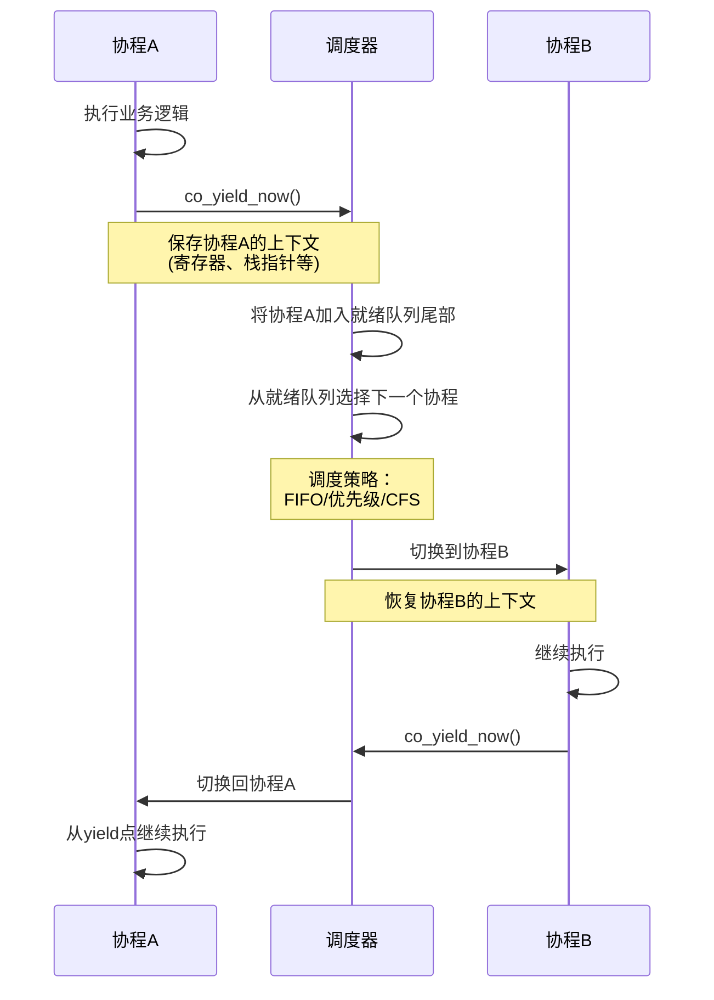
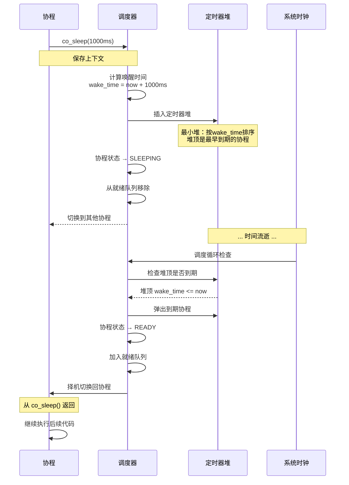
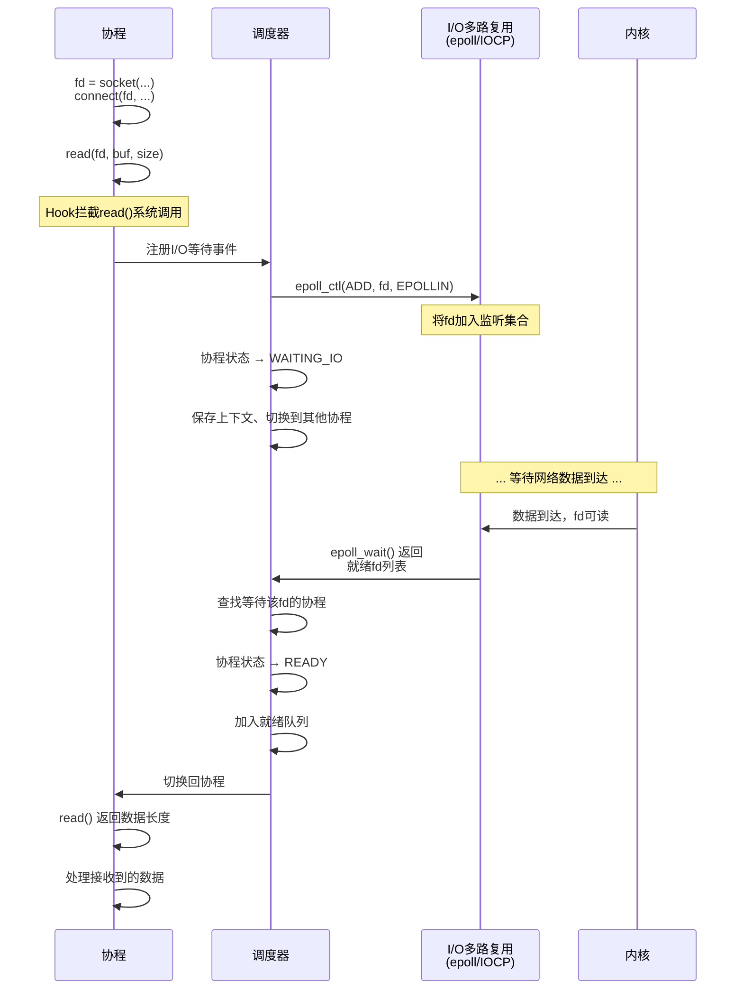

# 实现细节

## 上下文切换实现

### 1. Linux/macOS - ucontext 实现

```c
// src/platform/linux/context.c

#include <ucontext.h>

struct co_context {
    ucontext_t uctx;
    void* stack_base;
    size_t stack_size;
};

int co_context_init(co_context_t* ctx, 
                    void* stack_base,
                    size_t stack_size,
                    co_entry_func_t entry,
                    void* arg) {
    if (getcontext(&ctx->uctx) == -1) {
        return CO_ERROR_PLATFORM;
    }
    
    ctx->uctx.uc_stack.ss_sp = stack_base;
    ctx->uctx.uc_stack.ss_size = stack_size;
    ctx->uctx.uc_link = NULL;
    
    makecontext(&ctx->uctx, (void (*)())entry, 1, arg);
    
    ctx->stack_base = stack_base;
    ctx->stack_size = stack_size;
    
    return CO_OK;
}

int co_context_swap(co_context_t* from, co_context_t* to) {
    return swapcontext(&from->uctx, &to->uctx) == 0 ? CO_OK : CO_ERROR_PLATFORM;
}
```

### 2. Windows - Fiber 实现

```c
// src/platform/windows/context.c

#include <windows.h>

struct co_context {
    LPVOID fiber;
    void* stack_base;
    size_t stack_size;
    co_entry_func_t entry;
    void* arg;
};

static VOID CALLBACK fiber_entry(LPVOID param) {
    co_context_t* ctx = (co_context_t*)param;
    ctx->entry(ctx->arg);
}

int co_context_init(co_context_t* ctx,
                    void* stack_base,
                    size_t stack_size,
                    co_entry_func_t entry,
                    void* arg) {
    ctx->fiber = CreateFiber(stack_size, fiber_entry, ctx);
    if (!ctx->fiber) {
        return CO_ERROR_PLATFORM;
    }
    
    ctx->stack_base = stack_base;
    ctx->stack_size = stack_size;
    ctx->entry = entry;
    ctx->arg = arg;
    
    return CO_OK;
}

int co_context_swap(co_context_t* from, co_context_t* to) {
    // 首次调用时需要将当前线程转换为 Fiber
    if (!from->fiber) {
        from->fiber = ConvertThreadToFiber(NULL);
        if (!from->fiber) {
            return CO_ERROR_PLATFORM;
        }
    }
    
    SwitchToFiber(to->fiber);
    return CO_OK;
}
```

### 3. 手写汇编实现（可选，性能优化）

```asm
; src/platform/asm/context_x86_64.S
; x86_64 System V ABI

.text
.globl co_context_swap_asm

co_context_swap_asm:
    ; Save current context
    ; rdi = from, rsi = to
    
    ; Save callee-saved registers
    pushq %rbp
    pushq %rbx
    pushq %r12
    pushq %r13
    pushq %r14
    pushq %r15
    
    ; Save stack pointer
    movq %rsp, (%rdi)
    
    ; Restore target context
    movq (%rsi), %rsp
    
    ; Restore callee-saved registers
    popq %r15
    popq %r14
    popq %r13
    popq %r12
    popq %rbx
    popq %rbp
    
    ; Return to target
    ret
```

## 协程切换场景与流程

本节通过流程图展示三种典型的协程切换场景，帮助理解协程如何在实际应用中进行上下文切换。

### 场景1：co_yield_now() - 主动让出CPU

协程主动调用 `co_yield_now()` 让出CPU，是最基础的协程切换场景。



**关键步骤**：
1. 协程A调用 `co_yield_now()`
2. 保存协程A的寄存器状态到 `co_context_t`
3. 将协程A状态设为 `READY`，放入就绪队列
4. 调度器根据策略选择下一个协程B
5. 恢复协程B的上下文，切换执行流
6. 协程A等待下次被调度

---

### 场景2：co_sleep() - 定时休眠与唤醒

协程调用 `co_sleep()` 进入定时休眠，到期后自动唤醒。



**关键数据结构**：
- **定时器堆**：最小堆，O(log n) 插入/删除
- **wake_time**：绝对时间戳，避免累积误差
- **调度循环**：每次迭代检查堆顶是否到期

**精度保证**：
- 使用高精度时钟（`std::chrono` / `clock_gettime`）
- 休眠精度 < 10ms（取决于系统定时器分辨率）

---

### 场景3：I/O阻塞 - 异步等待与唤醒

协程执行阻塞I/O操作（如 `read()`、`accept()`），通过I/O多路复用实现异步等待。



**I/O Hook 机制**：
```c
// 实际的 read() hook 实现
ssize_t read(int fd, void* buf, size_t count) {
    if (!co_is_hooked() || !co_fd_is_nonblocking(fd)) {
        return __real_read(fd, buf, count);  // 调用真实系统调用
    }
    
    // 设置非阻塞
    co_fd_set_nonblock(fd);
    
    // 尝试立即读取
    ssize_t ret = __real_read(fd, buf, count);
    if (ret >= 0 || errno != EAGAIN) {
        return ret;  // 成功读取或发生错误
    }
    
    // EAGAIN：暂无数据，注册 I/O 事件并等待
    co_scheduler_t* sched = co_current_scheduler();
    co_routine_t* co = co_current_routine();
    
    co_iomux_add(sched->iomux, fd, CO_EVENT_READ, co);
    
    // 必须用 co_context_swap() 直接切回调度器，不能用 co_yield_now()。
    // co_yield_now() 会无条件将协程加回 ready_queue，
    // 调度器就不会调用 co_iomux_poll()。
    co->state = CO_STATE_WAITING;
    sched->waiting_io_count++;
    co_context_swap(&co->context, &sched->main_ctx);
    
    // 被唤醒后，数据已就绪
    return __real_read(fd, buf, count);
}
```

**多路复用选择**：
- **Linux**: `epoll` (边缘触发，高效)
- **macOS**: `kqueue`
- **Windows**: `IOCP` (完成端口，异步I/O)

---

### 切换性能对比

| 场景 | 延迟 | 用途 |
|------|------|------|
| **co_yield_now()** | ~10-50ns | 协作式调度、避免饥饋 |
| **co_sleep()** | 精度 < 10ms | 定时任务、限流、重试 |
| **I/O等待** | 取决于网络延迟 | 高并发服务器、异步请求 |

**优化建议**：
- **减少yield频率**：批量处理任务后再让出
- **使用非阻塞I/O**：避免整个线程阻塞
- **合理设置超时**：防止协程永久挂起

## 调度器实现

### 核心数据结构

```c
// src/co_sched.c

struct co_scheduler {
    // 主上下文
    co_context_t main_ctx;
    
    // 当前运行协程
    co_routine_t* current;
    
    // 就绪队列（双向链表）
    co_queue_t ready_queue;
    
    // 睡眠队列（最小堆）
    co_timer_heap_t sleep_heap;
    
    // I/O 多路复用
    co_iomux_t* iomux;
    
    // 栈池
    co_stack_pool_t* stack_pool;
    
    // 配置
    co_sched_config_t config;
    
    // 统计
    co_stats_t stats;
    
    // 状态标志
    int running;
    int stopped;
};

// 队列实现（侵入式双向链表）
typedef struct co_queue {
    co_routine_t* head;
    co_routine_t* tail;
    size_t count;
} co_queue_t;

static inline void co_queue_push(co_queue_t* q, co_routine_t* co) {
    co->next = NULL;
    co->prev = q->tail;
    
    if (q->tail) {
        q->tail->next = co;
    } else {
        q->head = co;
    }
    
    q->tail = co;
    q->count++;
}

static inline co_routine_t* co_queue_pop(co_queue_t* q) {
    co_routine_t* co = q->head;
    if (!co) return NULL;
    
    q->head = co->next;
    if (q->head) {
        q->head->prev = NULL;
    } else {
        q->tail = NULL;
    }
    
    co->next = co->prev = NULL;
    q->count--;
    return co;
}
```

### 调度循环

```c
co_error_t co_scheduler_run(co_scheduler_t* sched) {
    sched->running = 1;
    sched->stopped = 0;
    
    while (sched->running && !sched->stopped) {
        // 1. 检查定时器，唤醒到期的协程
        uint64_t now_ms = get_monotonic_time_ms();
        while (sched->sleep_heap.count > 0) {
            co_routine_t* co = co_timer_heap_peek(&sched->sleep_heap);
            if (co->wakeup_time > now_ms) {
                break;
            }
            co_timer_heap_pop(&sched->sleep_heap);
            co->state = CO_STATE_READY;
            co_queue_push(&sched->ready_queue, co);
        }
        
        // 2. 计算下一次定时器到期时间
        int timeout_ms = -1;
        if (sched->sleep_heap.count > 0) {
            co_routine_t* next = co_timer_heap_peek(&sched->sleep_heap);
            timeout_ms = (int)(next->wakeup_time - now_ms);
            if (timeout_ms < 0) timeout_ms = 0;
        }
        
        // 3. 等待 I/O 事件
        // 只有存在等待 I/O 的协程时才调用 co_iomux_poll()，
        // 否则 ready_queue 和 timer_heap 均为空意味着所有协程已完成。
        if (sched->iomux && (sched->waiting_io_count > 0 ||
                             !co_timer_heap_empty(&sched->timer_heap))) {
            co_iomux_poll(sched->iomux, timeout_ms);
        }
        
        // 4. 调度就绪协程
        co_routine_t* co = co_queue_pop(&sched->ready_queue);
        if (!co) {
            // 没有就绪协程
            if (sched->stats.active_routines == 0 && sched->waiting_io_count == 0) {
                // 所有协程都结束了
                break;
            }
            // 等待事件
            continue;
        }
        
        // 5. 切换到协程
        sched->current = co;
        co->state = CO_STATE_RUNNING;
        
        co_context_swap(&sched->main_ctx, &co->context);
        
        // 协程返回
        sched->current = NULL;
        
        // 6. 处理协程状态
        if (co->state == CO_STATE_DEAD) {
            // 协程结束，回收资源
            co_routine_destroy(co);
            sched->stats.total_routines_destroyed++;
            sched->stats.active_routines--;
        } else if (co->state == CO_STATE_READY) {
            // 重新入队
            co_queue_push(&sched->ready_queue, co);
        }
        // WAITING 状态的协程在等待队列中
        
        sched->stats.total_switches++;
    }
    
    sched->running = 0;
    return CO_OK;
}
```

### co_yield_now 实现

```c
co_error_t co_yield_now(void) {
    co_scheduler_t* sched = co_scheduler_self();
    if (!sched || !sched->current) {
        return CO_ERROR_STATE;
    }
    
    co_routine_t* co = sched->current;
    co->state = CO_STATE_READY;
    
    // 切换回调度器
    co_context_swap(&co->context, &sched->main_ctx);
    
    return CO_OK;
}
```

### co_sleep 实现

```c
co_error_t co_sleep(uint32_t msec) {
    if (msec == 0) {
        return co_yield_now();
    }
    
    co_scheduler_t* sched = co_scheduler_self();
    if (!sched || !sched->current) {
        return CO_ERROR_STATE;
    }
    
    co_routine_t* co = sched->current;
    
    // 设置唤醒时间
    uint64_t now_ms = get_monotonic_time_ms();
    co->wakeup_time = now_ms + msec;
    
    // 加入睡眠队列
    co->state = CO_STATE_WAITING;
    co_timer_heap_push(&sched->sleep_heap, co);
    
    // 切换回调度器
    co_context_swap(&co->context, &sched->main_ctx);
    
    return CO_OK;
}
```

## 定时器堆实现

```c
// src/co_timer_heap.c

// 最小堆，按 wakeup_time 排序
typedef struct co_timer_heap {
    co_routine_t** heap;
    size_t count;
    size_t capacity;
} co_timer_heap_t;

static void heap_sift_up(co_timer_heap_t* h, size_t idx) {
    co_routine_t* item = h->heap[idx];
    
    while (idx > 0) {
        size_t parent = (idx - 1) / 2;
        if (h->heap[parent]->wakeup_time <= item->wakeup_time) {
            break;
        }
        h->heap[idx] = h->heap[parent];
        idx = parent;
    }
    
    h->heap[idx] = item;
}

static void heap_sift_down(co_timer_heap_t* h, size_t idx) {
    co_routine_t* item = h->heap[idx];
    size_t half = h->count / 2;
    
    while (idx < half) {
        size_t child = 2 * idx + 1;
        size_t right = child + 1;
        
        if (right < h->count && 
            h->heap[right]->wakeup_time < h->heap[child]->wakeup_time) {
            child = right;
        }
        
        if (item->wakeup_time <= h->heap[child]->wakeup_time) {
            break;
        }
        
        h->heap[idx] = h->heap[child];
        idx = child;
    }
    
    h->heap[idx] = item;
}

void co_timer_heap_push(co_timer_heap_t* h, co_routine_t* co) {
    if (h->count >= h->capacity) {
        // 扩容
        size_t new_cap = h->capacity * 2;
        h->heap = realloc(h->heap, new_cap * sizeof(co_routine_t*));
        h->capacity = new_cap;
    }
    
    h->heap[h->count] = co;
    heap_sift_up(h, h->count);
    h->count++;
}

co_routine_t* co_timer_heap_pop(co_timer_heap_t* h) {
    if (h->count == 0) return NULL;
    
    co_routine_t* result = h->heap[0];
    h->count--;
    
    if (h->count > 0) {
        h->heap[0] = h->heap[h->count];
        heap_sift_down(h, 0);
    }
    
    return result;
}
```

## I/O 多路复用实现

### Linux - epoll

```c
// src/platform/linux/iomux_epoll.c

#include <sys/epoll.h>

struct co_iomux {
    int epfd;
    struct epoll_event* events;
    size_t capacity;
    // fd -> co_routine_t 映射
    co_routine_t** fd_map;
    size_t fd_map_size;
};

co_iomux_t* co_iomux_create(void) {
    co_iomux_t* mux = malloc(sizeof(co_iomux_t));
    
    mux->epfd = epoll_create1(EPOLL_CLOEXEC);
    mux->capacity = 64;
    mux->events = malloc(sizeof(struct epoll_event) * mux->capacity);
    mux->fd_map_size = 1024;
    mux->fd_map = calloc(mux->fd_map_size, sizeof(co_routine_t*));
    
    return mux;
}

int co_iomux_add(co_iomux_t* mux, int fd, co_io_event_t events, co_routine_t* co) {
    if (fd >= mux->fd_map_size) {
        // 扩展 fd_map
        size_t new_size = fd * 2;
        mux->fd_map = realloc(mux->fd_map, new_size * sizeof(co_routine_t*));
        memset(mux->fd_map + mux->fd_map_size, 0, 
               (new_size - mux->fd_map_size) * sizeof(co_routine_t*));
        mux->fd_map_size = new_size;
    }
    
    mux->fd_map[fd] = co;
    
    struct epoll_event ev;
    ev.events = 0;
    if (events & CO_IO_READ) ev.events |= EPOLLIN;
    if (events & CO_IO_WRITE) ev.events |= EPOLLOUT;
    ev.data.fd = fd;
    
    return epoll_ctl(mux->epfd, EPOLL_CTL_ADD, fd, &ev);
}

// Linux epoll 实现：ET 模式，data.ptr 存 wait_ctx，天然批量返回
int co_iomux_poll(co_iomux_t* mux, int timeout_ms) {
    int n = epoll_wait(mux->epfd, mux->events, mux->capacity, timeout_ms);
    
    for (int i = 0; i < n; i++) {
        co_io_wait_ctx_t* wait_ctx = mux->events[i].data.ptr;
        co_routine_t* co = wait_ctx->routine;
        
        if (co && co->state == CO_STATE_WAITING) {
            // 唤醒协程
            co->state = CO_STATE_READY;
            // 通过 routine->scheduler 获取调度器，语义比
            // co_current_scheduler() 更精确，不依赖全局变量。
            co->scheduler->waiting_io_count--;
            co_queue_push(&co->scheduler->ready_queue, co);
        }
    }
    
    return n;
}

// Windows IOCP 实现：使用 GetQueuedCompletionStatusEx（Vista+）批量取出完成包，
// 与 epoll_wait 在"一次调用处理多个事件"的语义上对齐。
// 通过 OVERLAPPED 成员偏移还原 wait_ctx 指针（CONTAINING_RECORD 风格）。
// entries[i].Internal 存储 NTSTATUS，非 0 表示 I/O 操作失败。
int co_iomux_poll(co_iomux_t* mux, int timeout_ms) {
    ULONG removed = 0;
    BOOL ret = GetQueuedCompletionStatusEx(
        mux->iocp, mux->entries, mux->max_events,
        &removed, timeout_ms < 0 ? INFINITE : timeout_ms, FALSE);
    
    if (!ret) { return GetLastError() == WAIT_TIMEOUT ? 0 : -1; }
    
    int woken = 0;
    for (ULONG i = 0; i < removed; i++) {
        co_io_wait_ctx_t* wait_ctx = CONTAINING_RECORD(
            mux->entries[i].lpOverlapped, co_io_wait_ctx_t, overlapped);
        co_routine_t* co = wait_ctx->routine;
        
        wait_ctx->bytes_transferred = mux->entries[i].dwNumberOfBytesTransferred;
        if (mux->entries[i].Internal != 0) {   // NTSTATUS 非 0 = 失败
            wait_ctx->revents |= CO_IO_ERROR;
        }
        
        if (co && co->state == CO_STATE_WAITING) {
            co->state = CO_STATE_READY;
            co->scheduler->waiting_io_count--;
            co_queue_push(&co->scheduler->ready_queue, co);
            woken++;
        }
    }
    return woken;
}
```

## Channel 实现

```c
// src/co_channel.c

struct co_channel {
    size_t elem_size;
    size_t capacity;
    
    // 环形缓冲区
    void* buffer;
    size_t head;
    size_t tail;
    size_t count;
    
    // 等待队列
    co_queue_t send_queue;
    co_queue_t recv_queue;
    
    int closed;
};

co_channel_t* co_channel_create(size_t elem_size, size_t capacity) {
    co_channel_t* ch = malloc(sizeof(co_channel_t));
    ch->elem_size = elem_size;
    ch->capacity = capacity;
    ch->buffer = capacity > 0 ? malloc(elem_size * capacity) : NULL;
    ch->head = ch->tail = ch->count = 0;
    ch->closed = 0;
    
    memset(&ch->send_queue, 0, sizeof(co_queue_t));
    memset(&ch->recv_queue, 0, sizeof(co_queue_t));
    
    return ch;
}

co_error_t co_channel_send(co_channel_t* ch, const void* data) {
    if (ch->closed) {
        return CO_ERROR_CLOSED;
    }
    
    // 尝试唤醒等待接收的协程
    co_routine_t* receiver = co_queue_pop(&ch->recv_queue);
    if (receiver) {
        // 直接传递数据
        memcpy(receiver->chan_data, data, ch->elem_size);
        receiver->state = CO_STATE_READY;
        co_queue_push(&receiver->scheduler->ready_queue, receiver);
        return CO_OK;
    }
    
    // 缓冲区有空间
    if (ch->count < ch->capacity) {
        void* dest = (char*)ch->buffer + (ch->tail * ch->elem_size);
        memcpy(dest, data, ch->elem_size);
        ch->tail = (ch->tail + 1) % ch->capacity;
        ch->count++;
        return CO_OK;
    }
    
    // 需要阻塞
    co_routine_t* current = co_self();
    if (!current) {
        return CO_ERROR_STATE;
    }
    
    // 保存数据指针
    current->chan_data = (void*)data;
    current->state = CO_STATE_WAITING;
    co_queue_push(&ch->send_queue, current);
    
    // 让出 CPU
    co_yield_now();
    
    return ch->closed ? CO_ERROR_CLOSED : CO_OK;
}

co_error_t co_channel_recv(co_channel_t* ch, void* data) {
    // 缓冲区有数据
    if (ch->count > 0) {
        void* src = (char*)ch->buffer + (ch->head * ch->elem_size);
        memcpy(data, src, ch->elem_size);
        ch->head = (ch->head + 1) % ch->capacity;
        ch->count--;
        
        // 唤醒等待发送的协程
        co_routine_t* sender = co_queue_pop(&ch->send_queue);
        if (sender) {
            // 将发送者的数据放入缓冲区
            void* dest = (char*)ch->buffer + (ch->tail * ch->elem_size);
            memcpy(dest, sender->chan_data, ch->elem_size);
            ch->tail = (ch->tail + 1) % ch->capacity;
            ch->count++;
            
            sender->state = CO_STATE_READY;
            co_queue_push(&sender->scheduler->ready_queue, sender);
        }
        
        return CO_OK;
    }
    
    // 尝试直接从发送者接收
    co_routine_t* sender = co_queue_pop(&ch->send_queue);
    if (sender) {
        memcpy(data, sender->chan_data, ch->elem_size);
        sender->state = CO_STATE_READY;
        co_queue_push(&sender->scheduler->ready_queue, sender);
        return CO_OK;
    }
    
    // Channel 已关闭且无数据
    if (ch->closed) {
        return CO_ERROR_CLOSED;
    }
    
    // 需要阻塞
    co_routine_t* current = co_self();
    if (!current) {
        return CO_ERROR_STATE;
    }
    
    current->chan_data = data;
    current->state = CO_STATE_WAITING;
    co_queue_push(&ch->recv_queue, current);
    
    // 让出 CPU
    co_yield_now();
    
    return ch->closed ? CO_ERROR_CLOSED : CO_OK;
}
```

## 栈池实现

```c
// src/co_stack_pool.c

struct co_stack_pool {
    size_t stack_size;
    void** stacks;
    size_t capacity;
    size_t count;
};

co_stack_pool_t* co_stack_pool_create(size_t stack_size, size_t initial_capacity) {
    co_stack_pool_t* pool = malloc(sizeof(co_stack_pool_t));
    pool->stack_size = stack_size;
    pool->capacity = initial_capacity;
    pool->count = 0;
    pool->stacks = malloc(sizeof(void*) * initial_capacity);
    
    // 预分配栈
    for (size_t i = 0; i < initial_capacity; i++) {
        pool->stacks[i] = malloc(stack_size);
        pool->count++;
    }
    
    return pool;
}

void* co_stack_pool_alloc(co_stack_pool_t* pool) {
    if (pool->count > 0) {
        return pool->stacks[--pool->count];
    }
    return malloc(pool->stack_size);
}

void co_stack_pool_free(co_stack_pool_t* pool, void* stack) {
    if (pool->count < pool->capacity) {
        pool->stacks[pool->count++] = stack;
    } else {
        free(stack);
    }
}
```

## 性能优化技巧

### 1. 内存对齐

```c
// 确保关键结构体对齐到缓存行
#define CACHE_LINE_SIZE 64

struct co_routine {
    // 热数据（经常访问）
    co_state_t state;
    co_context_t context;
    co_routine_t* next;
    co_routine_t* prev;
    
    // 填充到缓存行边界
    char __padding1[CACHE_LINE_SIZE - 
                    sizeof(co_state_t) - 
                    sizeof(co_context_t) - 
                    sizeof(void*) * 2];
    
    // 冷数据（较少访问）
    uint64_t id;
    void* stack_base;
    size_t stack_size;
    // ...
} __attribute__((aligned(CACHE_LINE_SIZE)));
```

### 2. 栈保护页

```c
// 在栈底部添加保护页，检测栈溢出
void* co_stack_alloc_protected(size_t size) {
    size_t page_size = sysconf(_SC_PAGESIZE);
    size_t total_size = size + page_size;
    
    void* mem = mmap(NULL, total_size, 
                     PROT_READ | PROT_WRITE,
                     MAP_PRIVATE | MAP_ANONYMOUS, -1, 0);
    
    // 设置保护页
    mprotect(mem, page_size, PROT_NONE);
    
    return (char*)mem + page_size;
}
```

### 3. TLS 优化

```c
// 使用 __thread 避免 pthread_getspecific 开销
__thread co_scheduler_t* __tls_current_scheduler = NULL;

static inline co_scheduler_t* co_scheduler_self(void) {
    return __tls_current_scheduler;
}
```

## 下一步

参见：
- [04-testing.md](./04-testing.md) - 测试策略
- [05-build.md](./05-build.md) - 构建配置
